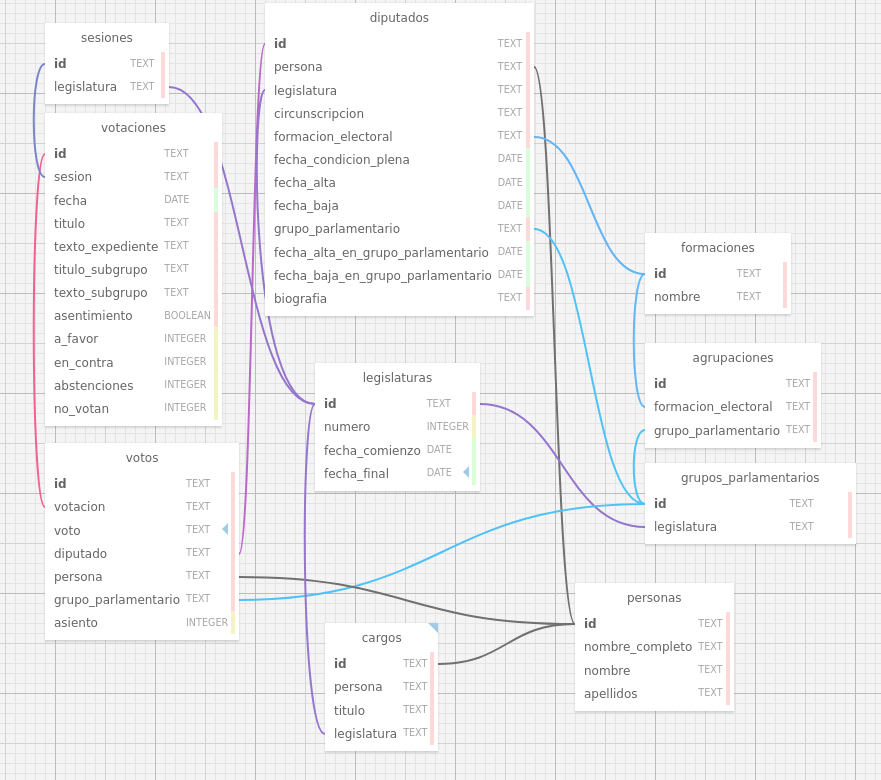

# Database

Warning: Work In Progress

## Schema

The database diagram and schema has been created using [WWW SQL Designer](https://github.com/ondras/wwwsqldesigner),
a FOSS tool that not only allows drawing database designs as Entity-Relationship Diagrams but also exporting these
designs as [Data Definition Language statements](./ddl.sql).

WWW SQL Designer saves and loads designs as [XMLs](./schema.xml). It does not allow exporting the design as a static
image so a [screenshot](./schema.png) must be taken.
